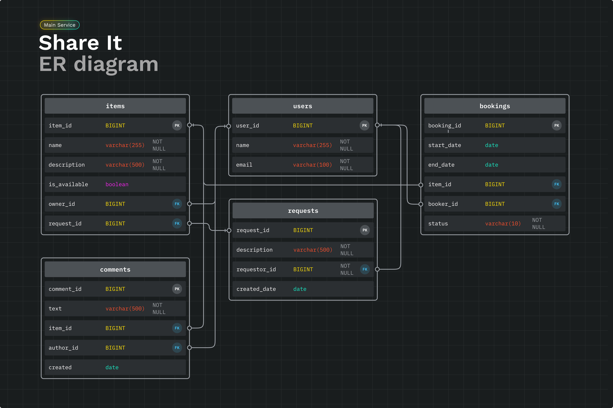

# Share It

Сервис для шеринга вещей.

Шеринг как экономика совместного использования набирает сейчас всё большую полярность. Если в 2014 году глобальный рынок шеринга оценивался всего в $15 млрд, то к 2025 может достигнуть $335 млрд.

Проект обеспечивает пользователям, во-первых, возможность рассказывать, какими вещами они готовы поделиться, а во-вторых, находить нужную вещь и брать её в аренду на какое-то время.


## Используемые технологии

**Клиент:** RestTemplate

**Сервер:** Java 11, Spring Boot, Maven, Hibernate, PostgreSQL, Lombok, Docker, Mockito


## Инструкция по запуску

Для развертывания приложения:

```bash
  mvn clean package
```
```bash
  docker compose up
```

В Docker оба сервиса и база данных PostgreSQL запускаются в отдельном контейнере каждый.


## Фичи

- Приложение разбито на два сервиса: Gateway - выполнение всей валидации запросов, исключение некорректных и Server - содержит всю основную бизнес-логику.
- Поиск доступных вещей по названию и описанию
- Возможность оставить отзыв после пользования вещью
- Возможность подтверждения или отклонения запроса на бронирование владельцем веща
- Создание запроса, если нужной вещи пока нет в наличии. В ответ на запросы можно добавлять вещи


## База данных




## Спецификация API
REST API приложения основан на каждой сущности:
- item
- booking
- user
- request

Например,

#### Поиск вещей по тексту с возможностью сортировки и пагинации

```http
GET /items/search
```

| Параметр | Тип     | Описание                |
| :-------- | :------- | :------------------------- |
| `text` | `String` | **Required.** Текст для поиска вещи по названию или описанию|
| `from` | `int` | Количество вещей, которые нужно пропустить для формирования текущего набора|
| `size` | `int` | Количество вещей в наборе|
| `sort` | `String` | Варианты сортировки: *ID_ASC, ID_DESC*|


## Postman

[Share It Postman Tests](https://raw.githubusercontent.com/NikitaBuffy/java-shareit/main/postman/sprint.json)


## Планы по доработке

- Переписать мок-тесты с учетом изменившейся архитектуры (были тесты до этого в коммите 0209876)
- Реализовать фичу с перепиской между двумя пользователями
- Добавить возможность подписываться на другого пользователя и получать уведомление о новых выставленных вещах или его новых запросах 